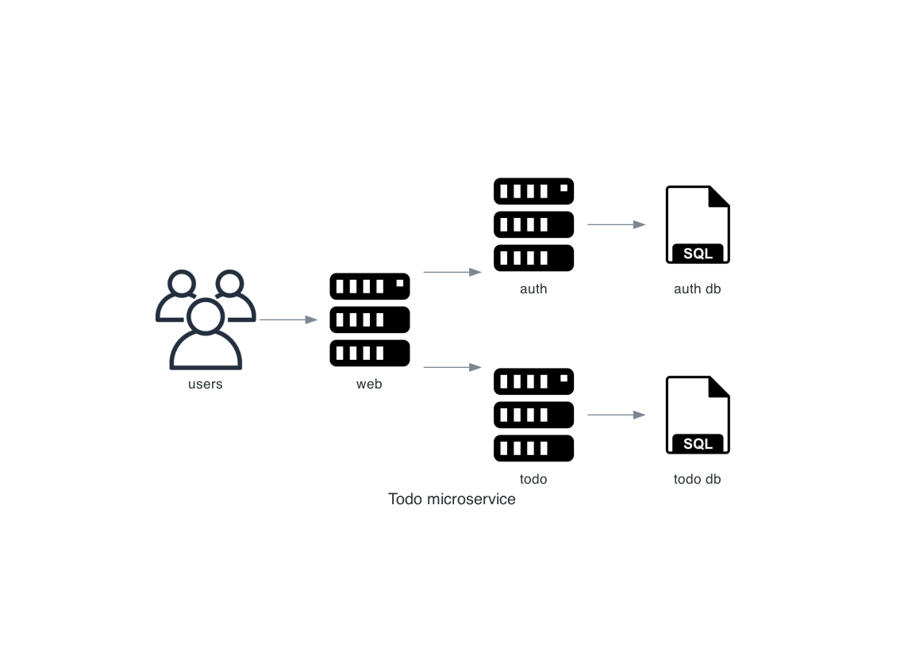

# Todo microservice

Diagram


---
# TODO: 
- [x] Auth service
- [x] Todo service
- [x] Run on <a id="orcestra">orcestra tool</a>
- [x] Load test <a id="autoscale">autoscale</a>
- [ ] monitoring
- [ ] api gate way
---
# Minikube

If use local image
```
  eval $(minikube docker-env)
```

minikube cmd 
```
docker build -t USERNAME/REPO .
minikube image load [name]:[tag]
minikube image load to-do-list-microservices_auth-service:latest
minikube image list

kubectl create deployment go-auth --image=docker.io/library/to-do-list-microservices_auth-service:latest
//NOTE ErrImagePull maybe can access to image location 


kubectl expose deployment go-auth --type=NodePort --port=8080
kubectl get services go-auth
minikube service go-auth
kubectl port-forward service/go-auth 8080:80

minikube kubectl -- get pods
```
---
# [K8S](#orcestra) 

```
docker build . [name]:[tag]
kubectl apply -f k8s/auth-depl.yaml
kubectl get deployment
kubectl get pods

// update image : latest tag
kubectl rollout restart deployment [depl_name]

```
### [Ingress](#ingress)
apply ingress
```
kubectl apply -f /k8s/ingress.yaml
```

add hostname to app
edit hosts file (/etc/hosts)


### [Autoscale](#autoscale) 
install metric
```
kubectl apply -f /k8s/metric-server.yaml
kubectl top pod
```

set auto scale
```
kubectl autoscale deployment auth-depl --cpu-percent=50 --min=1 --max=4
```

get Horizontal Pod Autoscaler
```
kubectl get hpa
```

load test 
```
kubectl run -i --tty load-generator --rm --image=busybox --restart=Never -- /bin/sh -c "while sleep 0.001; do wget -q -O- http://auth-srv/ping; done"

k6 ....
```


Environtment
```
kubectl create secret generic [name] --from-literal=[Key]=[Value]
```